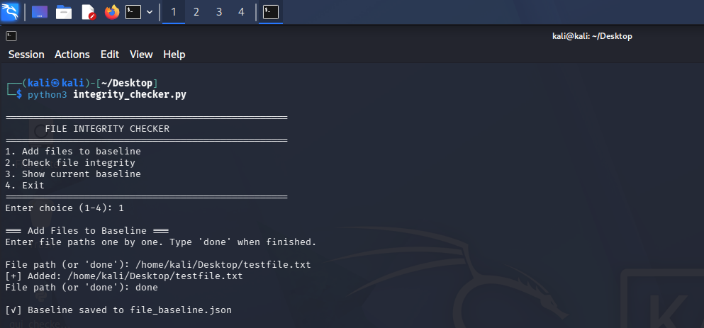
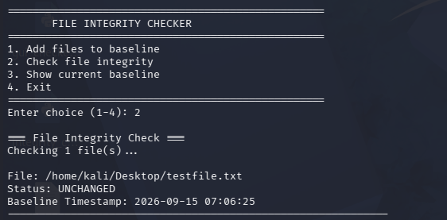
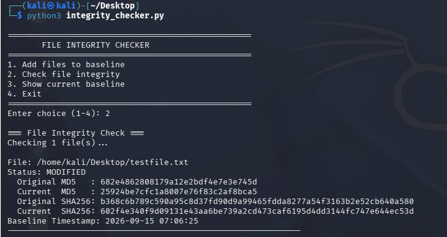
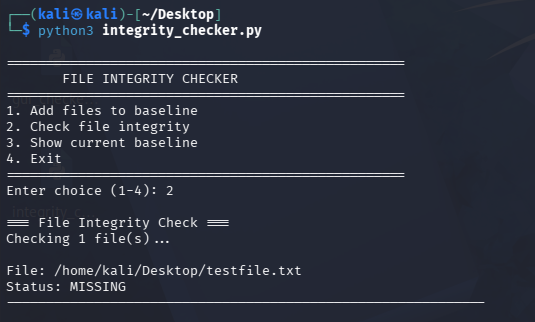

# 🔐 File Integrity Checker

A Python-based **File Integrity Monitoring (FIM)** tool that detects whether a file has been tampered with, modified, or deleted using cryptographic hashing.

---

## 📌 Overview

In cybersecurity, detecting unauthorized changes to critical system and configuration files is a fundamental defensive control.

This project implements the core logic behind enterprise **File Integrity Monitoring (FIM)** solutions such as **Wazuh, Tripwire, and AIDE**.

The tool generates **SHA-256 and MD5** cryptographic hashes for files. These hashes act as digital fingerprints and are stored as a trusted baseline in a JSON file along with a timestamp.

During an integrity check, the current hash is recalculated and compared with the stored baseline.

---

## ⚙️ How It Works

1. **Baseline Creation** — The tool calculates the hash of the selected file and stores it in `file_baseline.json`.
2. **Integrity Check** — The current hash is recalculated and compared with the stored baseline.
3. **Result Detection** — The tool identifies whether the file is unchanged, modified, or missing.

| Result          | Meaning                                       |
| --------------- | --------------------------------------------- |
| ✅ **Unchanged** | Current hash matches the stored baseline      |
| ⚠️ **Modified** | Current hash differs from the stored baseline |
| ❌ **Missing**   | The monitored file no longer exists           |

---

## ✨ Features

* SHA-256 and MD5 hash generation
* Persistent baseline stored in JSON
* Timestamped baseline records
* Monitoring of multiple files
* Detection of Unchanged / Modified / Missing states
* Original vs. current hash comparison
* No external dependencies
* Built using Python standard libraries

---

## 🚀 Usage

### Clone the Repository

```bash
git clone https://github.com/Saqlain-Soc/file-integrity-checker.git
cd file-integrity-checker
```

### Run the Tool

```bash
python3 file_integrity_checker.py
```

### Main Options

```text
1. Add files to baseline
2. Check file integrity
3. Show current baseline
4. Exit
```

---

## 📸 Demo

### 1. Baseline Created

The file is added to the trusted baseline.



### 2. File Unchanged

The current hash matches the stored baseline.



### 3. File Modified

The current hash differs from the original baseline, and the tool displays the hash comparison.



### 4. File Missing

The monitored file no longer exists at its original path.



---

## 🧠 Why This Matters

File Integrity Monitoring is an important defensive security capability.

Attackers who gain access to a system may modify configuration files, binaries, scripts, or logs to establish persistence, change system behavior, or hide their activity.

Hash-based integrity monitoring helps security teams identify these unauthorized changes.

This project demonstrates the fundamental logic behind FIM capabilities used in security monitoring platforms such as **Wazuh**.

---

## 🛠️ Tech Stack

* **Python 3**
* `hashlib` — cryptographic hashing
* `json` — baseline persistence
* `os` — file handling
* `datetime` — timestamps

---

## 📈 Future Improvements

* Recursive directory monitoring
* Real-time file monitoring
* Email/webhook alerts
* SIEM log integration
* Automated alert generation
* Scheduled integrity checks

---

## 👤 Author

**Saqlain Abbas**

Cybersecurity / SOC Analyst

---

## ⚠️ Disclaimer

This project was developed for **educational and defensive cybersecurity purposes**.
